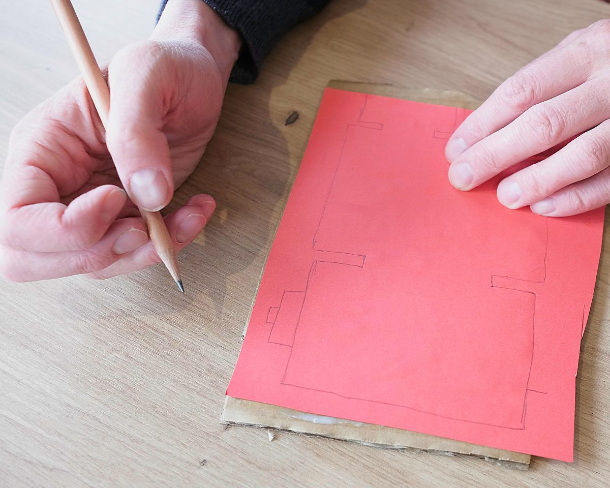
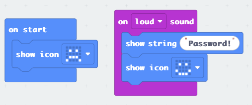
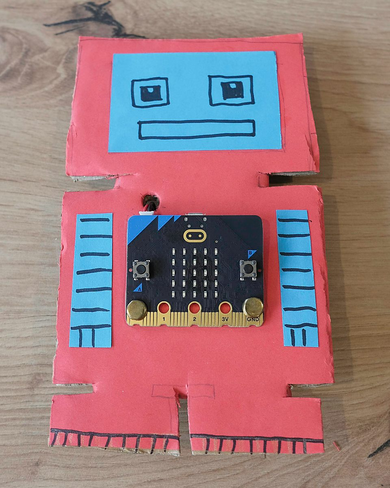

In this tutorial, you'll build your own puzzle robot using the micro:bit.  You'll program the robot to keep a secret, which it will only reveal when it detects the right inputs.  

Challenge your friends and family to see if they can solve the clue and find the secret!

## What you’ll need

To build your robot, you will need:
* One [micro:bit](https://microbit.org)\*, with a battery pack and cable for programming
* Some sheets of coloured card (ideally in a selection of colours)
* Some thicker cardboard (an old box will do)
* Glue
* A pencil and coloured pens
* Scissors 
* Two split pins to attach the micro:bit to the card, or alternatively two small nuts and bolts 
* (Optional) Decorations for your robot, such as stickers or googly eyes
* A computer to write the code and program the micro:bit

\* Don’t worry if you don’t have a micro:bit, many libraries in the UK have them available to borrow for free.  They are also quite cheap if you'd like to buy one of your own.

## Crafting the robot

Start with a piece of coloured card, roughly A5 size.  This is going to be the main colour of the robot, so pick the colour you’d like.

Next stick this to a piece of the thicker cardboard, to give it some strength.  We’ll be cutting our robot shape out of this later, so the edges don’t need to line up neatly.

Now use a pencil draw the outline of our robot.  There are all sorts of shapes you can choose from - you can give it a head and feet, or a big rounded body like R2D2.  Use your imagination and go for whatever you like!

Now we need to decide where the micro:bit is going to go.  We need to leave enough space for it to be attached later on, so place it on the robot and draw a pencil line to mark the shape.  I’ve put the micro:bit in the middle of most of my robots, but it could also work well as the head!

You could now pencil in a few draft lines showing how you’d like to decorate the robot, showing where you might put stickers or cut out card to add features.

Now it’s time to cut the robot out, following the line you drew earlier.

You should now have a robot shape, ready to decorate!

Finally, add some features to the robots to bring them to life!  You can use a different coloured card to add on things like eyes, marker pens to draw details such as gears and circuitry, or to add colours (metallic pens would be ideal for this).  You could even add stickers or things like googly eyes!

Now the robots are ready, it’s time to move on to the micro:bit!

## Designing the puzzle
We’re going to program the micro:bit with a secret word, which it will only reveal when it receives the right input.

There are lots of ways we can use the micro:bit's features for this.  For example, you could show the secret word when your micro:bit robot:
* Gets turned upside down
* Hears a loud noise (micro:bit version 2 needed for this!)
* Has its buttons, or the touch logo pressed
* Sees its somewhere dark
* Points North (it has a built in compass!)
* Gets shaken

Have a look at [the micro:bit website](https://microbit.org/get-started/features/overview/) for the full list of features, if you're not sure what to choose!

We'll look at how to program three of these options in the next section - shaking, noise detection and an option combining two inputs.

## Writing the code

We’re going to use the [Microsoft MakeCode](https://makecode.microbit.org/) website to program the micro:bit.  Open up the site, then click *New Project*.

Let's start with the code for the robot which will reveal the secret word when you shake it.

We can use the `on shake` block from the Input section.  This will run code when the micro:bit detects a shake, so all we need to do here is add a `show string` block to show our secret word.  I've used "Password!" in this code, but change this for the word (or sentence) you'd like to use.

I've also added some code to the `on start` block, so the micro:bit will show a sad face icon when it turns on.  When the secret word has been found, we swap this to a happy face

If you'd like to detect different types of movement, like getting turned upside down or detecting when the micro:bit is dropped, click the drop down menu in the `on shake` block.

Next let’s look at the code to show the secret word when the micro:bit hears a loud noise.  

As you can see it's really similar, you just need to use the `on loud sound` Input block instead of `on shake`.

If you'd like to make it a bit harder to get the secret word out of your micro:bit, let’s combine two inputs - turning upside down and pressing a button.

The code gets a little bit more complicated here.  We used the simple input blocks before, but these can only check for one thing at a time.  We can use the `on logo down` block to detect when the micro:bit's been turned upside down, but we then need an `If` block inside this to also check for the button press.

## Giving a clue

We need to give people a clue for how to get the secret word (and a reminder in case you forget!), so let’s add some code to scroll a hint on the screen when we press the A button.  Here's the code to give the clue for our shake bot.

We also need a block here to put our sad face back again afterwards, otherwise we'll just be left with a blank screen.

Try and come up with a clue that’s helpful, but not too easy! 

Here are the clues for the loud noise...

...and the turning upside down and pressing B:

Once you’ve added your clue, your code is finished and ready to download the code to your micro:bit.

Connect your micro:bit to your computer and click the *Download* button, then don't forget to test that the puzzle and the clue are working correctly.

## Attaching the micro bit

Now all we need to do is attach our micro:bit to the robot.

Hold your micro:bit up to the robot in the spot you marked earlier and use a pencil to mark the two holes in the bottom corners.

Then take the microbit away, and poke the pencil through to make holes, with some blutack or similar behind the robot so the pencil doesn’t damage anything when it goes through.

Now put the micro:bit back into position, and secure it with two split pins (or nuts and bolts if you have any!)

Finally, poke a hole for the battery cable...

 ...then tape the battery pack onto the back and push the cable back through to connect to the micro:bit

## Your robot is ready!

Congratulations, you’ve created your own puzzle robot!

  
  
Now it’s time to challenge your friends - can they solve the clue and work out how to get the secret word?

Once they've found the secret, why not reprogram your robot with a more difficult challenge!

Here are a few ideas for a more advanced robot:

* Chain steps together - one secret action unlocks the next!  Show the clue for the next step when the first has been solved.
* Create a problem 2 micro:bits - require the secret action on both at the same time, and use radio to talk to each other!
* Add extra components to your robot, like LEDs for eyes. You could even make this part of the puzzle - press the button when the eyes light up!

I hope you enjoy making your robots!  Let me know how you get on, and please share photos of your designs, I'd love to see what you create!