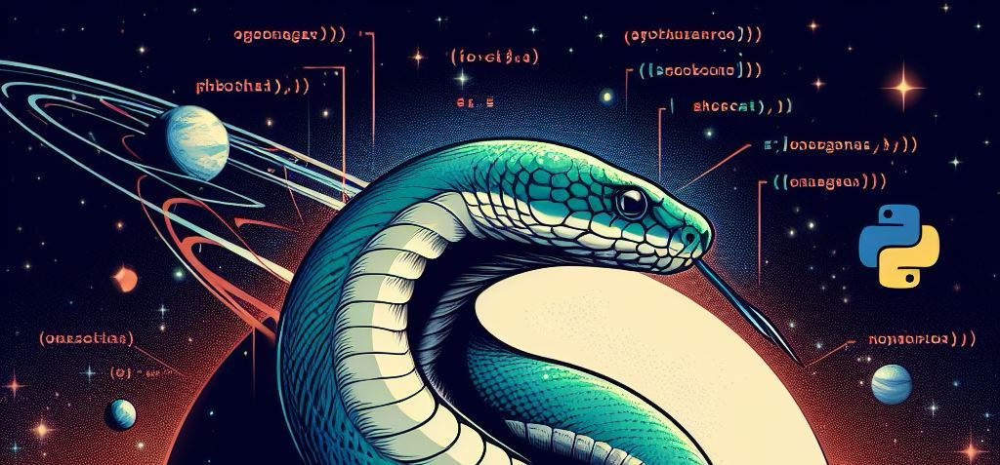
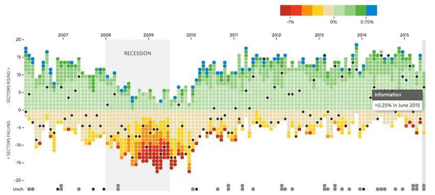
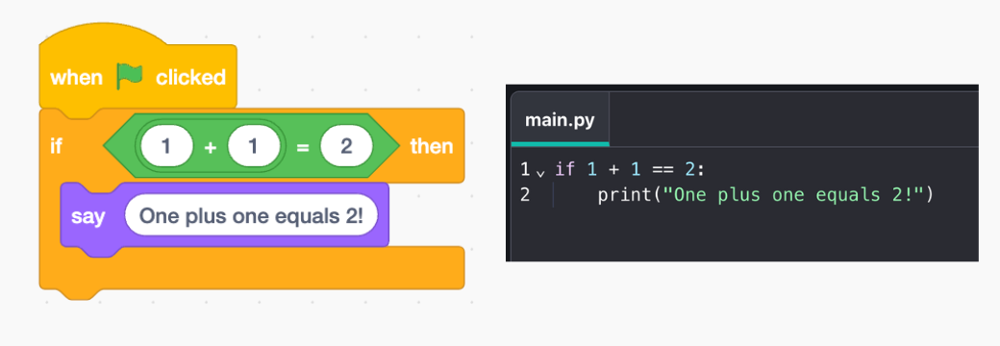
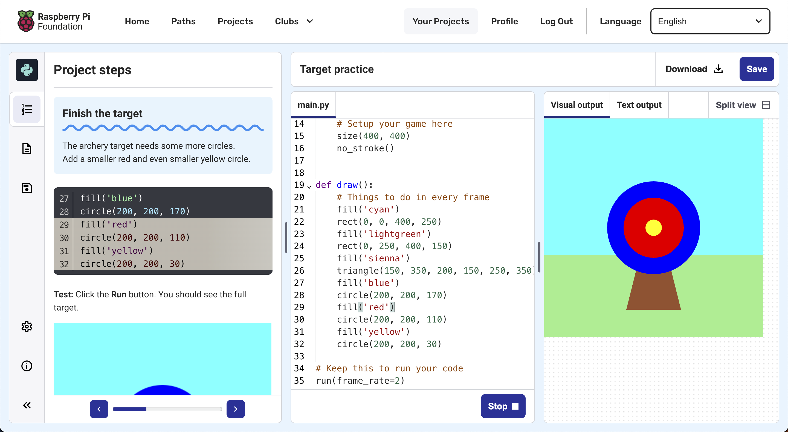
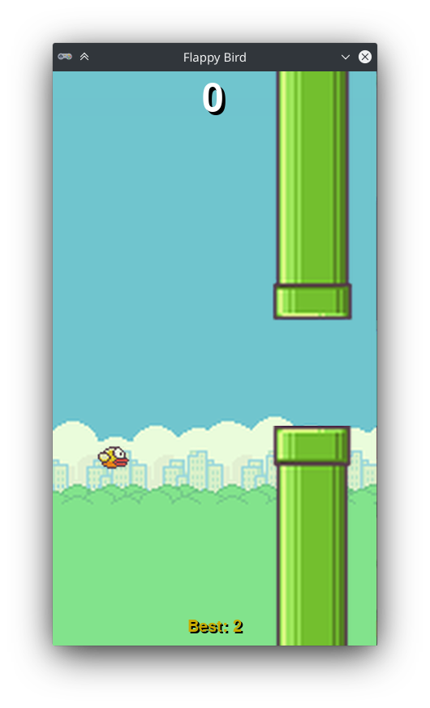
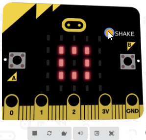
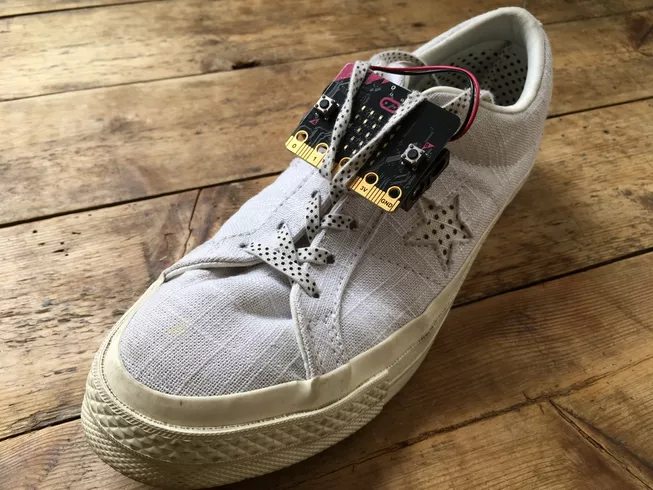

Kids often get their first experience of coding with Scratch, where they write programs by connecting blocks together.  This is a brilliant place to start, but there are limits to what can be achieved with this language.  Sooner or later they will outgrow this, and graduate to a text based programming language, where the instructions for the computer are typed out a bit like sentences.

For kids who have become comfortable with Scratch and the basics of coding, and are ready to make the leap to a text based language, Python is a great choice.  They can use this language to build all sorts of things, from games to animations or even websites.  And, as Python is a professional level programming language, they will be learning a skill which might even become part of their job one day.

## Are they ready?
Python uses a lot of the same programming concepts as Scratch, but it’s worth being sure your child is comfortable with the basics.  Moving on too quickly can be frustrating, as they won’t have the handy Scratch block panel to remind them what their options are.

I’d recommend being familiar with the following before looking at Python:

* Repeating code with loops, such as the `While` and `Repeat` blocks
* Making decisions about what code to run in different situations, with the `If…Else` block
* Storing and accessing values, using variables

These are all common coding concepts, which they’ll be able to carry into Python, as well as any other languages they might pick up in the future.

If your child wants some extra practice with Scratch, take a look at these [Learning Paths](https://projects.raspberrypi.org/en/collections/scratch).

## Why Python?
Python is an excellent choice for a first text-based programming language, as it is reasonably simple to read and write, and to understand what the code is doing.

It’s also incredibly versatile.  You can use Python to write pretty much anything, including games, animations, apps and websites, as well as programming physical devices like the Micro:bit.

In real world applications it’s particularly popular for data science and machine learning applications, but it’s a solid choice no matter what you’d like to build.

A graph showing economic data, made with Python ([Source](https://www.shanelynn.ie/data-visualisation-in-python-pycon-dublin-2018-presentation/))

## How is Python different to Scratch?

Text based programming languages like Python use the same concepts as Scratch, but need to be typed out instead of dragging and dropping blocks.

The following picture shows the same code written in Scratch (left) and in Python (right).

A comparison of the same code in Scratch (left) and Python (right).

Note how the code inside the `if` statement is shifted to the right - this is how Python knows what to run if the condition is true.  In Scratch we put the blocks inside other blocks, but in Python we just add spaces at the start of the line (this is called indenting).

Watch out for small mistakes!  Everything needs to be typed precisely in a text based language, otherwise the computer won’t be able to tell what you mean. This is often a source of frustration for professionals developers, not just kids!

Look out for these common errors:
* Spelling of functions and variables - they’re case sensitive and it’s easy to mistype!
* It’s particularly easy to get the indentation wrong with python, which might cause the code to run at an unexpected time.

## How to get started

The Raspberry Pi Foundation has a great series of tutorials to take kids through the basics of Python- the [Introduction to Python Learning Path](https://projects.raspberrypi.org/en/pathways/python-intro).

The step by step instructions will help your kid learn the basics of Python, complete with graphics.  The projects can be completed entirely in a web browser, there’s no need to install any extra software.

In the “Rocket Launch” project you create an animated space ship.

The learning path makes use of the Raspberry Pi Foundation’s new online code editor, which put the instructions, code and output all on one screen making it really easy for kids to follow along as they build the projects.

The Raspberry Pi Foundation’s Python Editor, with project instructions.

Once they’ve got the hang of the basics, the projects become more complex, and there is more freedom for kids to make their own design choices. This encourages them to experiment and solidify the skills which they are learning, as well as allowing them to use their creativity and make the results their own.

Later projects include building your own character:

A series of illustrated faces, including a vampire, orange and robot.

As well as making a running game where you have to avoid the obstacles:

Examples of the running game, with different characters and settings.

## Where next?

If your child has completed the learning path and is looking for more to do with Python, there are plenty of options.

Sticking with the Raspberry Pi Projects, there is a [second part of the learning path](https://projects.raspberrypi.org/en/pathways/more-python) as well as loads more [Python projects on the Raspberry Pi Projects site](https://projects.raspberrypi.org/en/projects?software%5B%5D=python).

If you’re looking for something different, here are a few more ideas.

### Games

There are quite a few frameworks for building games with Python, but I’d recommend [PyGame Zero](https://www.google.com/search?client=safari&rls=en&q=puygamezzero&ie=UTF-8&oe=UTF-8) as a good option for beginners.

The [Simple Game Tutorials](https://simplegametutorials.github.io/pygamezero/) site has a good showcase of the things it can be used to build, and also includes tutorials for how to create them yourself. And of course there’s plenty of tutorials on YouTube, such as [this series](https://www.youtube.com/watch?v=z01Foh4-BPQ) creating a clone of the Flappy Bird game.

A Flappy Bird style game, built with Python and PyGame Zero

### Physical computing

Python can be used in all sorts of electronics projects, including writing code to control the Micro:bit embedded computer.  These are really common in primary schools in the UK, so your kids will probably already be familiar with them.

A great site for tutorials and ideas for Micro:bit projects is [Microsoft Makecode](https://makecode.microbit.org/).

You can make everything from a rock paper scissors game...

Rock paper scissors on the micro:bit ([Instructions](https://makecode.microbit.org/projects/rock-paper-scissors-v2))
… to a step counter:

A micro:bit step counter ([Instructions](https://makecode.microbit.org/projects/step-counter))

### Write Code for Astronauts

And finally, the [Mission Zero program](https://astro-pi.org/mission-zero/) gives kids the chance to write code which will run on the International Space Station.

It’s a great beginner python project, and will only take about an hour. Later on in the year the code will be sent up to a special computer on the space station, where the astronauts will see the output. You’ll even get a certificate showing the position of the ISS above the Earth, at the time when your program ran.

The Astro Pi computer

## Have fun with Python!

There are loads of great options for getting started with Python, but the most important thing is to find a project which is meaningful to your kids, and gets them excited about continuing their tech journey.

Please do share their creations in the comments, I’d love to see what everyone gets up to. And, if you’d like to show off the creations to a wider audience, you can submit their work to the [Coolest Projects](https://online.coolestprojects.org/take-part) showcase.

Huge thanks for reading! If you found this article useful, please do share it with a friend or on social media.